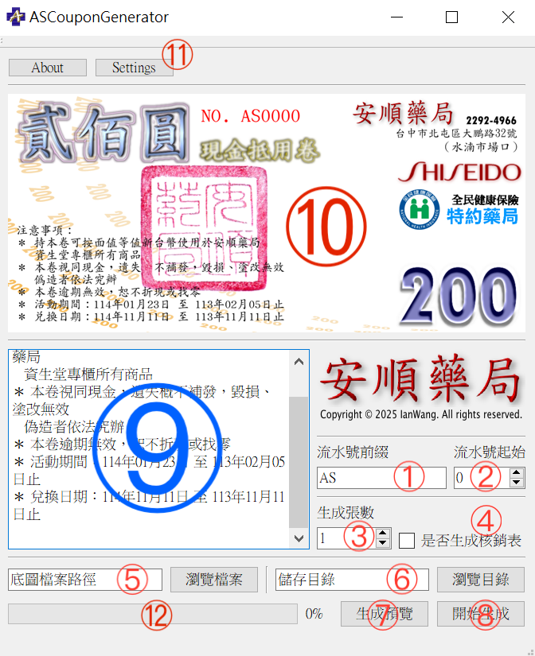

# ASCouponGenerator

## 使用說明

①
: 輸入流水號前綴，可為數字或文字

②
: 流水號起始值，可輸入 1~9999 的整數

③
: 生成禮卷的張數，可輸入 1~9999 的整數

④
: 如要生成核銷表請勾選此項，輸出結果將存放於與禮卷輸出相同的目錄

⑤
: 底圖檔案路徑輸入欄，可以直接手動鍵入絕對路徑，或點選右側的“瀏覽檔案”開啟檔案選擇器

⑥
: 輸出結果儲存路徑輸入欄，可以直接手動鍵入絕對路徑，或點選右側的“瀏覽目錄”開啟目錄選擇器
> 注意！！：本欄位格式較特殊，最頂層目錄需放置輸出檔案的檔名

⑦
: 生成單張預覽禮券於 ⑩ 之欄位

⑧
: 開始生成鈕，按下後將輸出整版禮卷的 PDF 檔與核銷表（可選）

⑨
: 禮卷右下側之注意事項欄位編輯器

⑩
: 禮卷預覽區

⑪
: 設定核銷表每隔幾欄顯示標題

⑫
: 禮卷生成進度條，顯示的單位為 ”目前生成之頁數/需生成的所有頁數“ 開始合併成 PDF 時則會顯示 "正在載入" 狀態
> 注意！！：合成禮卷時將花費較多時間，期間視窗可能會有卡頓屬正常現象，生成完成後將彈跳出 “生成完成” 提示視窗

